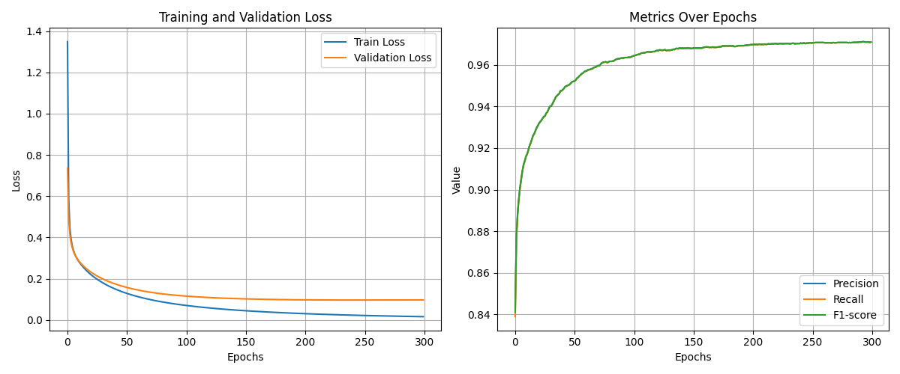
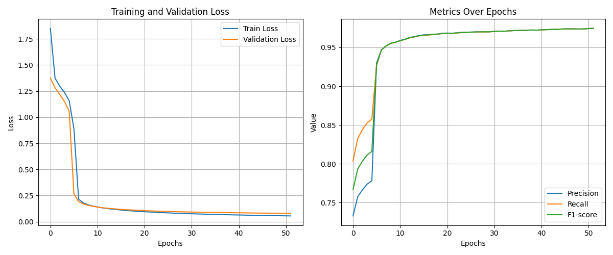
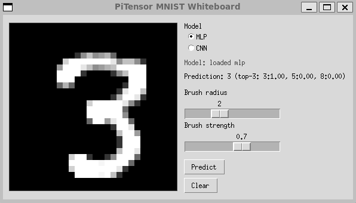

[](https://github.com/MarcoLoPinto/PiTensor/actions/workflows/ci.yml)

-------------------------------------------

PiTensor is a Deep Learning library implemented from scratch using NumPy. 

It aims to provide a clear and educational implementation of Neural Network components, including layers, activation functions, loss functions, optimizers, and metrics. 

This project is inspired by popular Deep Learning frameworks like PyTorch and TensorFlow.

## Installation

1.  Clone the repository:
    ```sh
    git clone https://github.com/MarcoLoPinto/PiTensor.git
    cd pitensor
    ```

2.  Create a new environment (conda/miniconda is preferred) and activate it for this project:
    ```sh
    conda create -n pitensor python=3.9
    conda activate pitensor
    ```

3.  Install the repository as a standard package:
    ```sh
    pip install .
    ```
    otherwise, if you want to modify the code while using the package, install it in editable mode:
    ```sh
    pip install -e .
    ```

## Features

- **Layers**: Linear, Convolutional, ReLU, MaxPool...
- **Loss Functions**: CrossEntropyLoss
- **Optimizers**: SGD, Adam
- **Metrics**: Precision, Recall, F1-Score
- **Data Loaders**: MNIST Digit Recognizer dataset
- **Training and Evaluation**: Training loop, validation, and metric evaluation.

It is important to note that PiTensor (*or, at least, this branch*) deliberately does support only sequential layers (i.e., no skip connections or concatenations). This is because, as previously stated, primary goal is to provide a clean and readable implementation of Deep Learning fundamentals.

## Playground

The `playground` folder contains runnable examples, experiments, and quick tests.
Start with `playground/mnist/example_mnist.py` for an end-to-end MNIST training example.

Training example (MLP training history):


Training example (CNN training history):


If you want to play with the models, there is a MNIST whiteboard inference demo in `playground/mnist/whiteboard_predict.py`:


## Contributing

Contributions to PiTensor are welcome. If there is interest in enhancing this educational Deep Learning framework, follow these steps:

1.  **Fork the Repository**:
    ```sh
    git clone https://github.com/MarcoLoPinto/PiTensor.git
    cd pitensor
    git checkout -b <your-branch-name>
    ```

2.  **Develop Changes**:
    - Ensure the code follows clean and minimalistic principles.
    - Keep modifications well-documented and easy to understand.

3. **Push and Submit a Pull Request**
    ```sh
    git add .
    git commit -m "Brief description of changes"
    git push origin <your-branch-name>
    ```

Then open the pull request to the appropriate branch for review.
